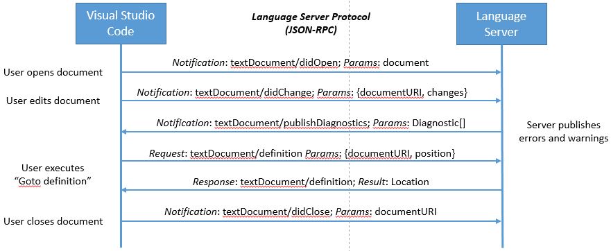
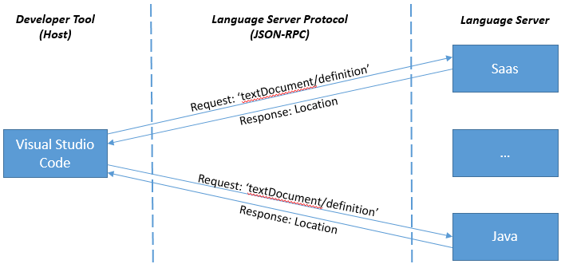
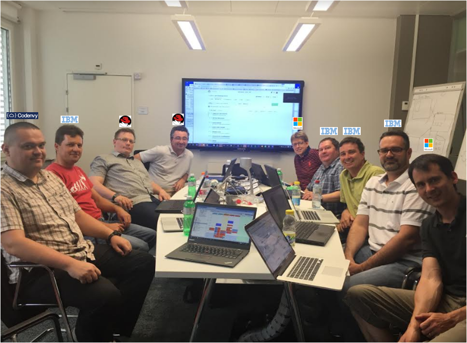

# Language Server Protocol

Authors:
[Dirk Bäumer](https://github.com/dbaeumer),
[Erich Gamma](https://github.com/egamma),
[Sean McBreen](https://github.com/seanmcbreen)

## How it started

The protocol was not created out of thin air, but it builds up on work and experiences from many others. Editors like [Vim](http://www.vim.org/) or [Emacs](https://www.gnu.org/software/emacs/) have used language servers or demons to provide semantic auto complete support since a while.

This concept was picked up by [OmniSharp](http://www.omnisharp.net/). OmniSharp provides auto complete and other rich editing features for C#. Initially OmniSharp used the http protocol with a JSON payload. OmniSharp has been integrated into several [editors](http://www.omnisharp.net/#integrations). One of them being VS Code.

Around the same time Microsoft started the work on a TypeScript language server, with the idea to support TypeScript in editors like [Emacs](https://www.gnu.org/software/emacs/) and [Sublime](https://www.sublimetext.com/). An editor communicates through stdin/stdout with the [TypeScript server](https://github.com/Microsoft/TypeScript/tree/master/src/server) process and uses a JSON payload inspired by the [V8 debugger protocol](https://github.com/v8/v8/wiki/Debugging-Protocol) for requests and responses. This TypeScript server has been integrated into the [TypeScript Sublime plugin](https://github.com/Microsoft/TypeScript-Sublime-Plugin). VS Code also uses this language server for its rich TypeScript editing experience.

After having consumed two different language servers in VS Code, we started to explore a common language server protocol for editors and IDEs. A common protocol enables a language provider to provide a language server that be consumed by different IDEs. A languge server consumer only has to implement the protocol once. This results in a win-win situation for both the language provider and the language consumer.

We started with the language protocol used by the TypeScript server, made it more general, and more language neutral. In a next step we enriched the protocol with more language features using the [VS Code language API](https://code.visualstudio.com/docs/extensionAPI/vscode-api#_languages)for inspiration. We picked [JSON-RPC](http://www.jsonrpc.org/) for remote invocation. It is simple and there are support libraries for many programming languages.

We have started the dogfooding of the protocol for what we called linter language servers. A linter language server responds to requests to lint a file and responds with the set of detected warnings and errors. We wanted to lint a file as the user edits a document. This means VS Code will emit many linting requests during an editor session. Therefore we wanted to keep a server up and running so that we do not need to start a new linting process for each user edit. We have implemented several linter servers, for example VS Code's [ESLint](https://marketplace.visualstudio.com/items?itemName=dbaeumer.vscode-eslint) or [TSLint](https://marketplace.visualstudio.com/items?itemName=eg2.tslint) extension. These two linter servers are both implemented in JavaScript and run on nodejs. They share a library that implements the client and server part of the protocol.

Soon after the [PowerShell](https://msdn.microsoft.com/en-us/powershell/mt173057.aspx) team was interested in adding PowerShell support for VS Code. They had already extracted their language support into a separate server implemented in C#. We then collaborated with them to evolve this PowerShell language server into a server that supports the common language protocol. During this effort we completed the client side consumption of the language server protocol in VS Code. The result is the first complete common language server protocol implementation available as the now popular [PowerShell extension](https://marketplace.visualstudio.com/items?itemName=ms-vscode.PowerShell).

## How it works

A language server runs in its own process and tools like VS Code communicate with the server using the language protocol over JSON-RPC. The actual transport channel can either be `stdio`, `sockets`, `named pipes` or `node ipc` if both the client and server is written in node. Below is an example for how a tool and a language server communicate during a routine editing session: 



* The user opens a file (referred to as a *document*) in the tool: The tool notifies the language server that a document is open ('textDocument/didOpen'). From now on the truth about the contents of the document is no longer on the file system but kept by the tool in memory.

* The user makes edits: The tool notifies the server about the document change ('textDocument/didChange') and the semantic information of the program is updated by the language server. As this happens, the language server analyses this information and notifies the tool with the detected errors and warnings ('textDocument/publishDiagnostics').

* The user executes "Goto Definition" on a symbol in the editor: The tool sends a 'textDocument/definition' request with two parameters (1) the document URI and (2) the text position from where the goto definition request was initiated to the server. The server responds with the document URI and the position of the symbol's definition inside the document.

* The user closes the document (file): A 'textDocument/didClose' notification is sent from the tool, informing the language server that the document is now no longer in memory and that the current contents is now up to date on the file system.

This example illustrates how the protocol communicates with the language server at the level of editor features like "Goto Definition", "Find all References". The data types used by the protocol are editor or IDE 'data types' like the currently open text document and the position of the cursor. The data types are not at the level of a programming language model which would usually provide abstract syntax trees and compiler symbols (e.g. resolved types, namespaces, ...). This simplifies the protocol significantly. 

Now let's look at the 'textDocument/definition' request in more detail. Below is what gets communicated between the tool and the language server for the "Goto Definition" request in C++ document. 

This is the request:
```json
{
    "jsonrpc": "2.0",
    "id" : 1,
    "method": "textDocument/definition",
    "params": {
        "textDocument": {
            "uri": "file:///p%3A/mseng/VSCode/Playgrounds/cpp/use.cpp"
        },
        "position": {
            "line": 3,
            "character": 12
        }
    }
}
```
This is the response:
```json
{
    "jsonrpc": "2.0",
    "id": "1",
    "result": {
        "uri": "file:///p%3A/mseng/VSCode/Playgrounds/cpp/provide.cpp",
        "range": {
            "start": {
                "line": 0,
                "character": 4
            },
            "end": {
                "line": 0,
                "character": 11
            }
        }
    }
}
```

In retrospect describing the data types at the level of the editor rather than at the level of the programming language model is one of the success factors of the language server protocol. It is much simpler to standardize a text document URI or a cursor position compared with standardizing an abstract syntax tree and compiler symbols across different programming languages.

When a user is working with different languages then VS Code typically starts a language server for each programming language. The example below shows a session where the user works on Java and SASS files.



We quickly learnt that not every language server can support all features defined by the protocol. We therefore introduce the concept of capabilities. With capabilities the client and server announces their supported feature set. As an example, a server announces that it can handle the 'textDocument/definition' request, but it might not handle the 'workspace/symbol' request. Similarly clients can announce that they are able to provide 'about to save' notifications before a document is saved, so that a server can compute textual edits to automatically format the edited document.

The actual integration of a language server into a particular tool is not defined by the language server protocol and is left to the tool implementors. Some tools integrate language servers generically by having an extension that can start and talk to any kind of language server. Others, like VS Code, create a custom extension per language server, so that an extension is still able to provide some custom language features.

To simplify the implementation of language servers and clients we  maintain an [npm module](https://www.npmjs.com/package/vscode-languageclient) to ease the integration of a language server into a VS Code extension and another [npm module](https://www.npmjs.com/package/vscode-languageserver) to write a language server using node.

## How it evolved

In spring 2016 we started to discuss the language server protocol with teams from RedHad and CodeEnvy, which resulted into a common [announcement](https://code.visualstudio.com/blogs/2016/06/27/common-language-protocol) of the collaboration. In preparation for this, we moved the specification of the protocol to a public [GitHub repository](https://github.com/Microsoft/language-server-protocol). Together with the language server protocol we made the language servers for JSON, HTML, CSS/LESS/SASS used by VS Code available as Open Source. 

To deepen the collaboration Microsoft hosted a hackathon in its Zurich lab in July 2016. The goal was to collaborate on a Java Language server that can be used in EclipseChe, Orion and VS Code. We made great progress during this week and it was good to see our old friends from IBM again.



In addition to the Java language server the team also started the integration of the VS Code provided language servers for CSS, JSON, and HTML into Eclipse.

Since then language servers for many programming languages have emerged. An extensive list of the language servers available can be found [here](https://github.com/Microsoft/language-server-protocol/wiki/Protocol-Implementations).

At the same time tools have started to adopt language servers. The protocol is now supported by [VS Code](https://code.visualstudio.com/), [MS Monaco Editor](https://www.npmjs.com/package/monaco-languageclient), [Eclipse Che](https://github.com/eclipse/che/issues/1287), [Eclipse IDE](https://projects.eclipse.org/projects/technology.lsp4e), [Emacs]((https://www.gnu.org/software/emacs/)), [GNOME Builder](https://git.gnome.org/browse/gnome-builder/tree/libide/langserv) and [Vim](https://github.com/autozimu/LanguageClient-neovim).  

The community provides us with great feedback about the language server protocol and even better we have received many pull requests that helped us to clarify the specification.

## Summary

The initial motivation for us to do the language server protocol was to ease the writing of linters and language server for VS Code. It was great to see how the open source community picked the protocol up, gave feedback, improved it and most importantly adopted it for other clients and developed a language server ecosystem around it. We would never have been able to do this by ourselves.